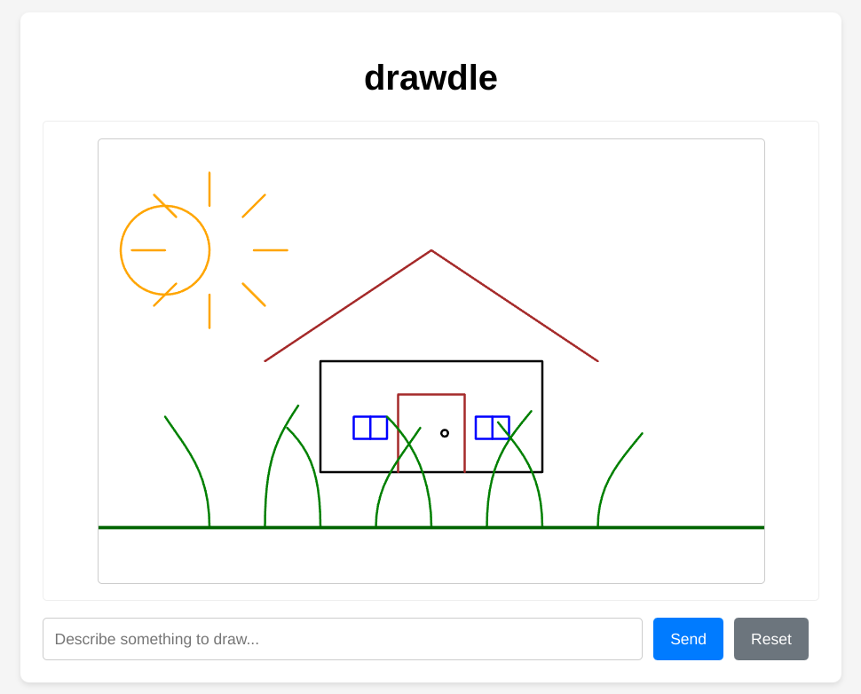

# drawdle

An interactive web application that generates and animates SVG drawings using AI. Simply describe what you want to draw and watch it come to life with smooth line-drawing animations.

## Features

- AI-powered SVG generation from text descriptions
- Real-time drawing animation with line-drawing effects
- WebSocket-based communication for live updates
- Clean and intuitive user interface
- Support for complex drawing elements and paths

## Setup

1. Clone the repository:
   `git clone https://github.com/yourusername/drawdle.git`
   `cd drawdle`

2. Create and activate a virtual environment (recommended):
   `python -m venv .venv`
   `source venv/bin/activate`  # On Windows use: `venv\Scripts\activate`

3. Install dependencies:
   `pip install -r requirements.txt`

4. Set up your environment variables:
   - Create a `.env` file
   - Add your Anthropic API key: `ANTHROPIC_API_KEY=your_key_here`

5. Run the application:
   `python app.py`

6. Open your browser and navigate to `http://localhost:8086`

## Usage

1. Enter a description of what you'd like to draw in the input field
2. Click "Send" or press Enter to generate and animate the drawing
3. Use "Reset" to clear the canvas and start over

## Technical Details

- Backend: Python with FastAPI and Claude AI
- Frontend: Vanilla JavaScript and CSS animations
- Real-time updates: WebSocket communication
- SVG Animation: CSS keyframes and dynamic path calculation

## TODO

- Support drawing input from the user
- Send back a screenshot to Claude as input
- Allow Claude to make edits to existing paths

## License

MIT
